# Netflix Clone


# Getting Started:
To run the Netflix Clone website locally on Windows OS, follow these steps:

1. **Clone the repository**:
   ```bash
   git clone https://github.com/your-username/netflix-clone.git
   cd netflix-clone
   ```

2. **Install dependencies**:
   ```bash
   cd server
   npm install
   cd ../frontend
   npm install
   cd ..
   ```

3. **Clear existing database** (if necessary):
   If you have a mongoDB database called "Netflix_database", make sure to clear it completely to avoid problems.

4. **Run the server**:
   a. The server should run on 8080 port, so make sure this port is free.
   ```bash
   netstat -ano
   taskkill /f /im [PID of the port 8080 got from previous command]
   ```
   ```bash
   cd server
   npm start
   cd ..
   ```

6. **Run the cpp server**
   ```bash
   cd cpp_server
   g++ src/ConsoleMenu.cpp src/DisplayRecommendedMoviesCommand.cpp src/AddMovieCommand.cpp src/HelpCommand.cpp src/DeleteCommand.cpp src/Utils.cpp -o output.exe -lws2_32
   ./output.exe
   cd ..
   ```

7. **Run the frontend**:
   ```bash
   cd frontend
   npm start
   ```

8. **Open your browser** and visit `http://localhost:3000` to access the Netflix Clone website.

## Run with Docker
1.Run on root folder:
```bash
docker-compose build
docker-compose up
```
**Note:** In order to get admin authentication in Docker server, there is need to change the 'isAdmin' field in the DB of the container.\
2. go to http://localhost:3000/ on browser. 

# API Functionality:
The Netflix Clone website incorporates the following API endpoints and functionalities:

## User:
- **GET users/:id**: Retrieve user details by providing the user ID.
- **POST /users**: Create a new user.
- **PUT /users/:id**: Change nickname or profile picture for a specific user.

## Token:
- **POST /tokens**: Generate a JSON Web Token (JWT) for registered users.

## Movies:
- **GET /movies/all**: Retrieve the list of all movies.
- **POST /movies**: Create a new movie.
- **GET /movies/:id**: Retrieve a specific movie.
- **PUT /movies/:id**: Update the details of a movie.
- **DELETE /movies/:id**: Delete a specific movie.

## Categories:
- **GET /categories**: Retrieve the list of all categories.
- **POST /categories**: Create a new category.
- **PUT /categories/:id**: Update a specific category.
- **DELETE /categories/:id**: Delete a specific category.

# Some Information About the App and How It Works:
- **Sign-Up Page**: You will get an alert if you try to sign-up with an existing email ("Email already exists" and 409 from the server). You will get a different alert if the fields are not filled properly.
- **Login Page**: You will get an alert if your password or email are incorrect.
- **JWT**: If the login worked (you filled a valid email and password), we will generate you a JWT, that will be used to monitor your access to things (like adding movies, comments, editing things, etc.).
- **Guest Access**: As a guest, you will have access to the movie, without the possibility to edit or delete them. This way, we can protect the information each user uploads.
- **Search**: You can search movies (by their title) using the search bar at the top of the page.
- **User Movies Page**: You can go to the user videos page if you press the link in the title of an existing movie. In this page, you can see all of this movie details.
- **Add Movie**: You will have the ability to add movies (link to admin page from the home page as well), delete your movies, and comment on existing movies.
- **Data Persistence**: When you add a user or a movie, it will be added to the database. So if you refresh a page or even run the app all over again, you will see all of the things you uploaded.

# Some Examples of How Our App Works:

- **Home Page (Logged-In User)**:
  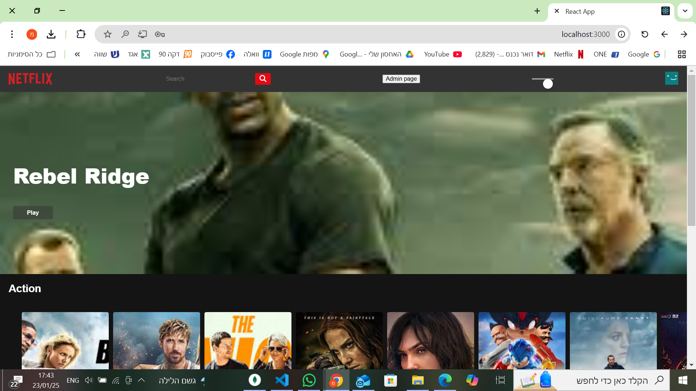
  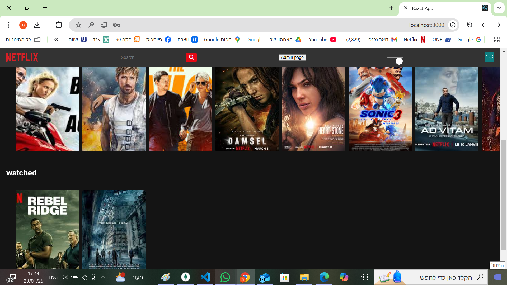

- **Using the Search Bar**:
   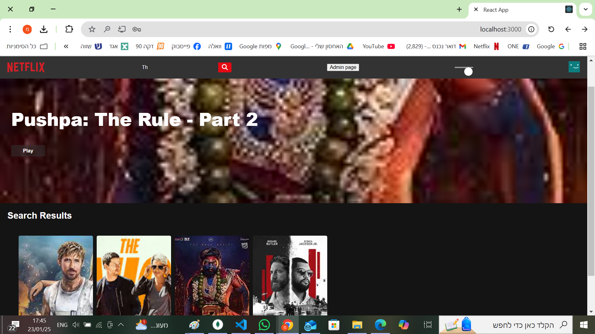

- **Movie Trailer**
  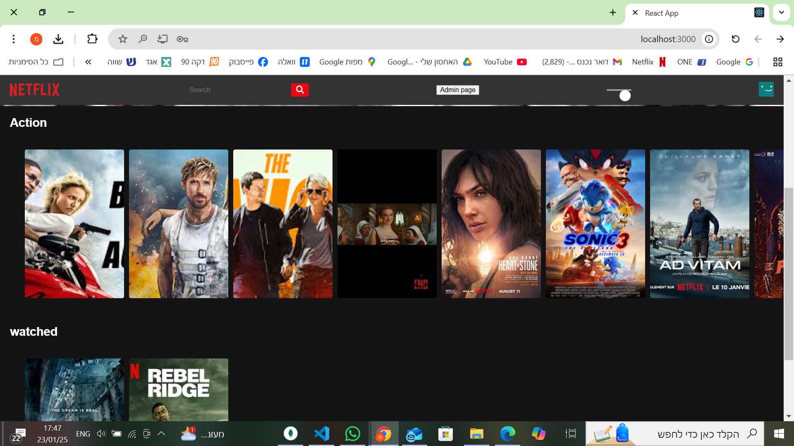
  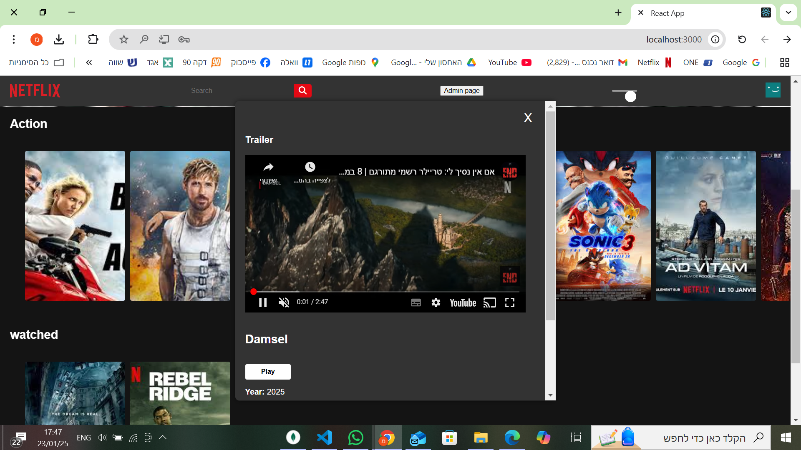
  
- **Watching on a Movie (Movie View Page)**:
  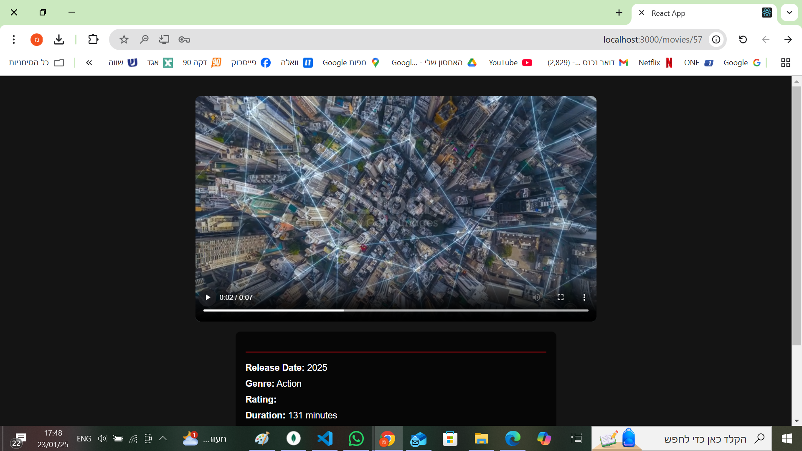

- **Editing a Movie**:
   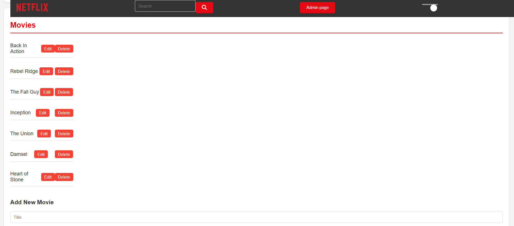

- **Add Movie**:
   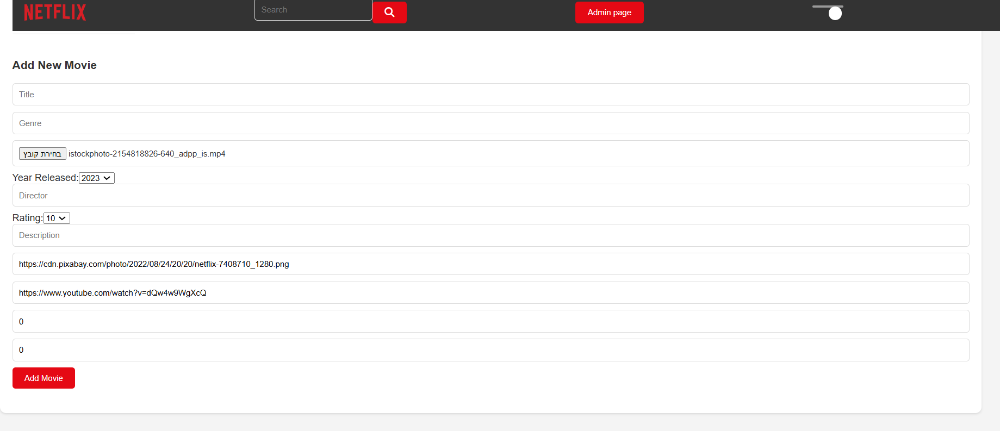

- **Add Category**:
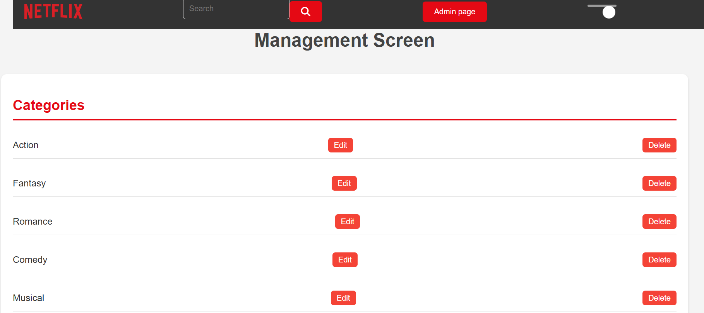

- **Sign-In Page**:
  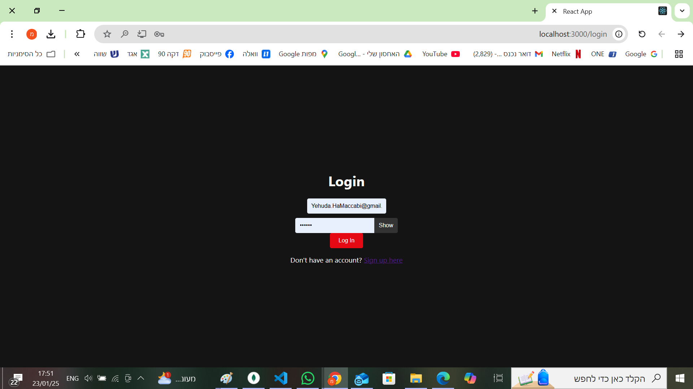


- **Sign-Up Page**:
 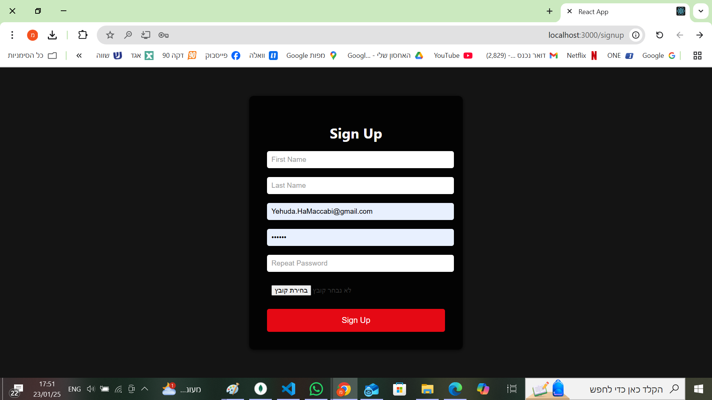


## Server and Recommendation System Overview
### Node.js Server Functionality
Our Node.js server includes a function that facilitates communication with a TCP server. This function is responsible for sending and receiving information, specifically the user and movie ID, to and from the TCP server.

- **Sending Data**: When a registered and signed-in user watches a movie, the function sends the user's user ID and the movie ID to the TCP server.\
- **Receiving Data**: The TCP server processes this information and returns a list of recommended movies based on the recommendation algorithm.
### Recommendation Logic
- **Registered Users:**

If the TCP server returns fewer than 20 recommended videos, the Node.js server supplements the list with the most viewed movies from the app. The recommended videos appear from most popular to least popular.

### Displaying Recommendations
Web Application: Recommended videos are displayed on the side of the video-view page (left side), similar to YouTube.

## TCP Server Details
The TCP server operates using the TCP protocol and handles requests through socket connections. The main socket links incoming requests to new sockets, which handle the actual processing. This setup enables multithreading and efficient request handling.

# Demo Run using Recommendation Algorithm:

lets start from skretch, lets make sure we connected to mongodb://localhost:27017 and the database called "Netflix_database" is clear from users and movies:
 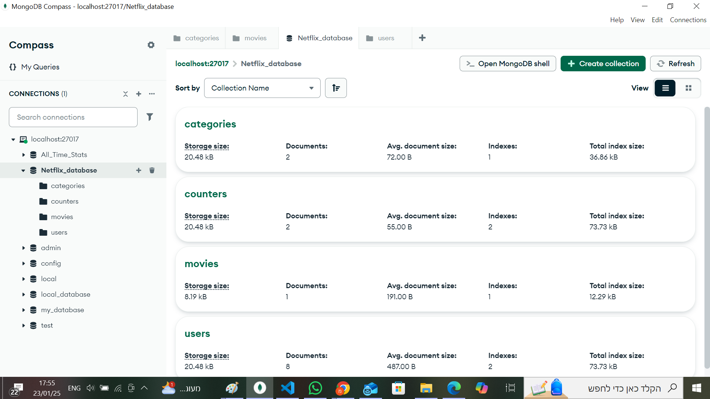

- **How to become admin**: Change the 'isAdmin' field of a certain user from false to true, like this:
 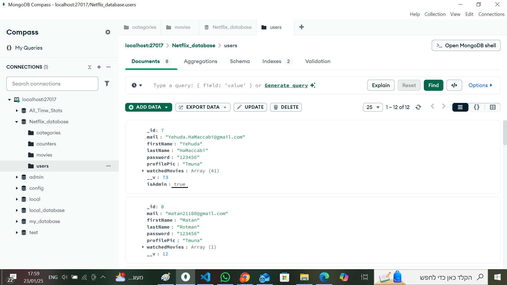

 Now the Admin screen will be available.

 # Some Examples of How Our the phone App Works:
 
 - **Sign-Up Screen**:
   
 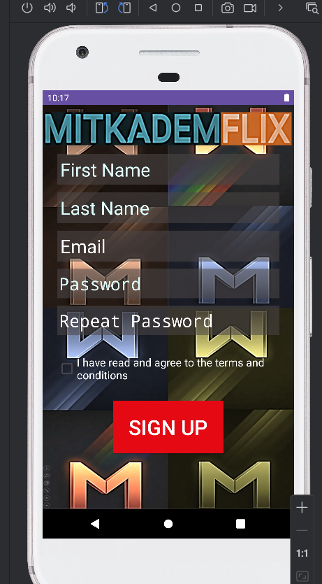
 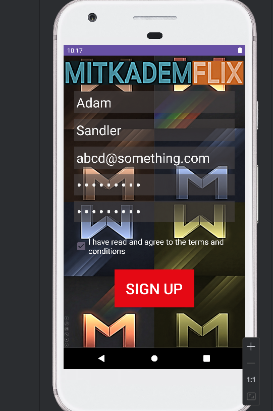

 - **Sign-In Screen**:
   
 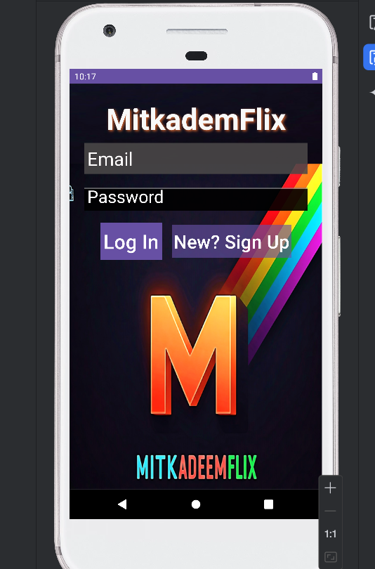
 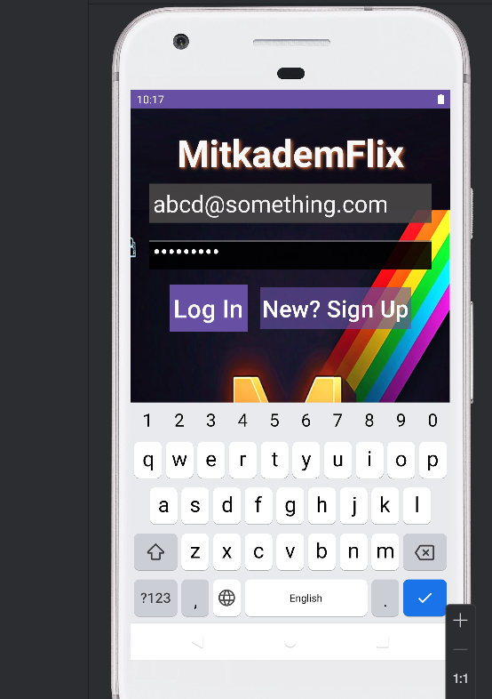

 - **Movies Screen**:

To see more movies on screen scroll down.

To enter information about a movie, click on its image.
   
 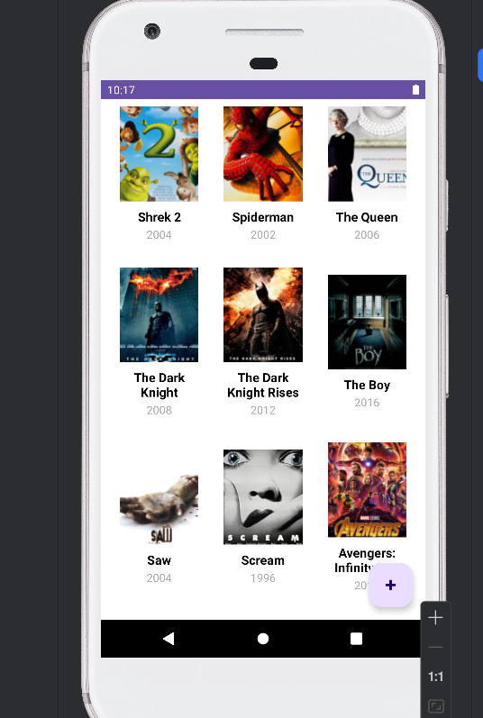
 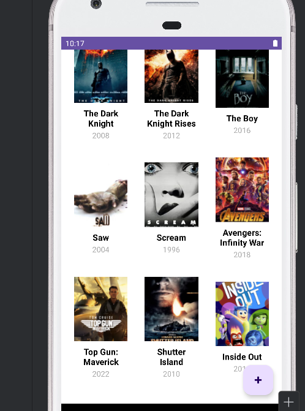

 - **Movie Info Screen**:
   
To the movie's trailer scroll down.
   
 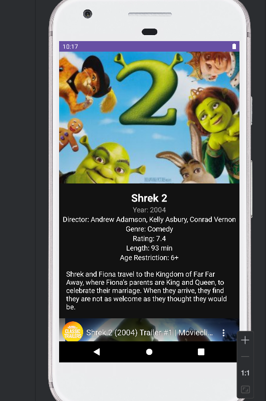
 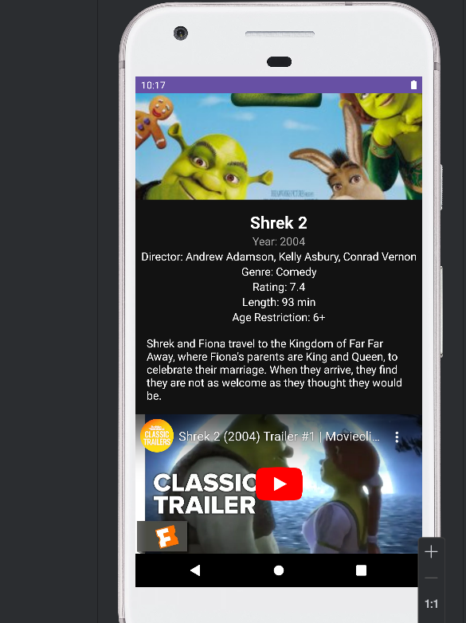
